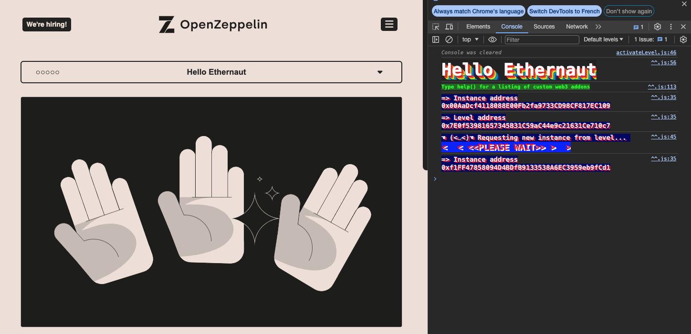
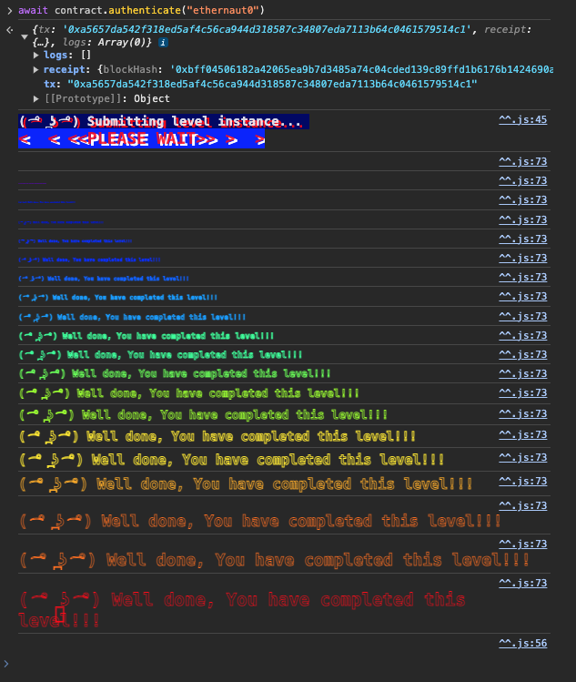

<!-- @format -->
# English README　[Jump to Japanese Version](#japanese)

# Ethernaut Solutions
- The Ethernaut is a Web3/Solidity-based coding wargame inspired by overthewire.org, played in the Ethereum Virtual Machine. 
- Each level is a smart contract that needs to be 'hacked'.

Here are the writeups of my solutions levels I cleared. 
** I will not recommend you to look at solutions I wrote. Solve it yourself for your learning 😛 **

# How to use Ethernaut
- To use ethernaut, you need to use the console from the developper tool of your browser in the first place.
- If your confortable with Foundry and Methods call using `cast` and `send`, you can also solve problem from Foundry framework.
- If you are not confortable yet with ABI, then it is a great way to learn about it and how to call any contract by external calls.
- In higher difficulty levels, you will need to wrote smart contracts and interfaces to hack some smart contract externally for clearing levels.

## Ethernaut 0. Hello Ethernaut

It is an introductory level, helping you set up for the upcoming levels and giving bits of the basic but necessary information. Let’s look into contract.info() as hinted in point number 9 of the explanations.

<br/>
<p align="center">

</p>
<br/>

By reading what functions are returning, it is easy to go through on this one. Each call shows an hint for the next function to call.
To look at the contract ABI use, `await contract.abi` .　


```bash
> await contract.info()
< 'You will find what you need in info1().'

> await contract.info1()
< 'Try info2(), but with "hello" as a parameter.'

> await contract.info2("hello")
< 'The property infoNum holds the number of the next info method to call.'
```

After calling `infoNum` we get the value `42`. An hint for the function info42() which is the next to call.

```bash
> await contract.info42()
< 'theMethodName is the name of the next method.'

> await contract.theMethodName()
< 'The method name is method7123949.'

> await contract.method7123949()
< 'If you know the password, submit it to authenticate().'
```

Here another hint, we doesn't know the password but by looking at the contract ABI, we can notice that there is a `password()` function returning a string.

```bash
> await contract.password()
< 'ethernaut0'
```
It returns 'ethernaut0'.
Which is what we need to submit to the `authenticate()` function.

```bash
> await contract.authenticate("ethernaut0")
```

Level is completed, and the explanation page disappear and shows the contract with which we were interacting from the beginning.

<br/>
<p align="center">

</p>
<br/>

<a name="japanese"></a>
# 日本語版のREADME

# Ethernautの解決策
- Ethernautは、overthewire.orgに触発されたWeb3/Solidityベースのコーディングウォーゲームで、Ethereum仮想マシンでプレイされます。
- 各レベルはハッキングする必要があるスマートコントラクトです。

これはクリアしたレベルの解決策です。
**解決策を見ることをお勧めしません。学習のために自分で解決してください 😛 **

# Ethernautの使用方法
- Ethernautを使用するには、まずブラウザの開発者ツールからコンソールを使用する必要があります。
- Foundryとcastおよびsendを使用した方法の呼び出しに慣れている場合、Foundryフレームワークから問題を解決することもできます。
- まだABIに慣れていない場合、それを使用して任意のコントラクトを外部呼び出しで呼び出す方法について学び、理解するのに最適な方法です。
- より高難度のレベルでは、スマートコントラクトとインターフェースを作成して、いくつかのスマートコントラクトを外部からハッキングするために解レベルをクリアする必要があります。

## Ethernaut 0. Hello Ethernaut

これは導入的なレベルであり、次のレベルに備えるのに役立ち、基本的で必要な情報の一部を提供します。ヒントとしてポイント9の説明で示されている `contract.info()` を見てみましょう。

<br/>
<p align="center">

</p>
<br/>

各関数の戻り値を読むことで、この問題は簡単に進むことができます。各呼び出しは、次に呼び出す関数のヒントを示しています。
コントラクトのABIを見るため、`await contract.abi`　を使って。

```bash
> await contract.info()
< 'You will find what you need in info1().'

> await contract.info1()
< 'Try info2(), but with "hello" as a parameter.'

> await contract.info2("hello")
< 'The property infoNum holds the number of the next info method to call.'
```

`infoNum` を呼び出した後、値  `42` を取得します。次に呼び出すべき `info42()` 関数のヒントです。

```bash
> await contract.info42()
< 'theMethodName is the name of the next method.'

> await contract.theMethodName()
< 'The method name is method7123949.'

> await contract.method7123949()
< 'If you know the password, submit it to authenticate().'
```

別のヒントです。私たちはパスワードを知りませんが、コントラクトのABIを見ると、文字列を返す `password()` 関数があることがわかります。

```bash
> await contract.password()
< 'ethernaut0'
```

それは 'ethernaut0' を返します。
これを `authenticate()` 関数に提出する必要があります。

```bash
> await contract.authenticate("ethernaut0")
```

レベルが完了し、説明ページが消えて、最初から対話していたコントラクトが表示されます。

<br/>
<p align="center">

</p>
<br/>
